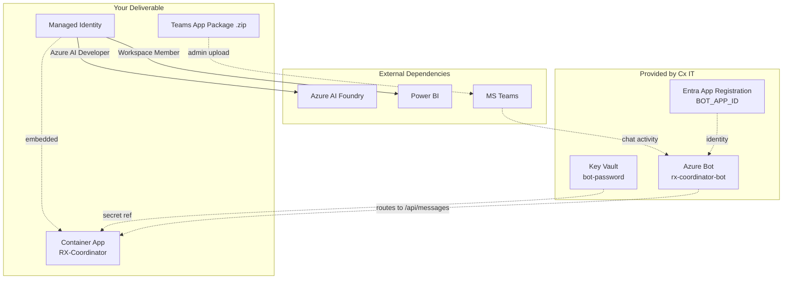

# Post-Provisioning Integration Steps

Once Cx IT has provisioned the Bot App Registration and Azure Bot resource,
this guide walks through everything the project team does to wire the pieces
together and get messages flowing end-to-end.

> Prerequisite: `docs/cx-it-handoff.md` checklist completed by Cx IT.

## Architecture After Cx IT Handoff



## Step-by-Step

### 1. Collect Values from Cx IT

Confirm these are in your possession before proceeding:

| Value | Example |
|---|---|
| `BOT_APP_ID` | `a1b2c3d4-5678-…` |
| Key Vault secret URL for `bot-password` | `https://kv-rx.vault.azure.net/secrets/bot-password/` |
| `MicrosoftAppType` | `MultiTenant` |
| Tenant ID (if SingleTenant/MI) | (optional) |
| Azure Bot resource name + RG | `rx-coordinator-bot` in `rg-rx-commercial` |
| Container App FQDN | `rx-coordinator.happyhill-abc123.eastus.azurecontainerapps.io` |

### 2. Verify Bot's Messaging Endpoint

Azure Portal → your Azure Bot resource → **Configuration** → Messaging endpoint should be:
```
https://<container-app-fqdn>/api/messages
```

If it's missing or wrong, ask Cx IT to update it. Incorrect endpoint = messages go into the void.

### 3. Verify Teams Channel Is Enabled

Azure Portal → your Azure Bot resource → **Channels** → Microsoft Teams row must show **Running** with a green checkmark.

If missing:
```powershell
az bot msteams create --resource-group <rg> --name rx-coordinator-bot
```

### 4. Configure Container App Env Vars

Azure Portal → Container App → **Containers** → Edit → **Environment variables**:

```
# Bot identity
BOT_APP_ID=<from Cx IT>
BOT_APP_PASSWORD=@Microsoft.KeyVault(SecretUri=https://<kv-name>.vault.azure.net/secrets/bot-password/)
MicrosoftAppType=MultiTenant
MicrosoftAppTenantId=

# Foundry
FOUNDRY_PROJECT_ENDPOINT=https://<project>.services.ai.azure.com/api/projects/<name>
FOUNDRY_QUERY_ENGINE_AGENT_ID=asst_xxxxx
FOUNDRY_ANALYST_AGENT_ID=asst_yyyyy

# Power BI
PBI_WORKSPACE_ID=4435d932-4c62-46fd-ba3f-dd41a0d6d2f4
PBI_DATASET_ID=b047fe92-8b73-4f06-a2ae-e75b9b9363a0
```

### 5. Verify MI Has Required Role Assignments

```powershell
# Get Container App's MI principalId
$miPid = az containerapp show -g <rg> -n <container-app-name> --query identity.principalId -o tsv

# Check role assignments
az role assignment list --assignee $miPid --all -o table
```

Required assignments:
- `Azure AI Developer` on the Foundry resource
- `Key Vault Secrets User` on the Key Vault
- (PBI membership must be checked in the PBI portal — no CLI)

If missing, ask Cx IT to grant them (see `docs/cx-it-handoff.md`).

### 6. Get the Teams App Package

Easiest path: **Teams Developer Portal** — no hand-editing JSON required.

1. Go to <https://dev.teams.microsoft.com>
2. **Apps → New app** → name: `RX Commercial Intelligence`
3. Fill **Basic information** (short name, full name, description, developer info, icons)
4. **App features → Bot**:
   - Paste `BOT_APP_ID` from Cx IT
   - Scopes: tick **Personal**, **Team**, **Group chat**
   - Add command lists:
     - `Load Factor` — e.g. What's the load factor on RUH-LHR for Q1 2025?
     - `Top Routes` — e.g. Top 5 routes by RASK last month
     - `Yield Analysis` — e.g. Compare yield in Business vs Economy
5. **Preview in Teams** → sanity-check the install experience
6. **Publish → Download app package** → `.zip` file

Alternative: Azure Portal → Azure Bot → **Channels** → Microsoft Teams → **Open in Teams** link opens a personal 1:1 chat with no install needed *(good for quick smoke test only — not shareable)*.

### 7. Hand the .zip to Cx IT Teams Admin

Cx IT Teams admin uploads via:
- <https://admin.teams.microsoft.com> → **Teams apps → Manage apps → Upload new app**
- Assign it to the Cx Commercial Insights app permission policy
- Pin via app setup policy for the Cx AD group

### 8. Test End-to-End

**Layer by layer — isolate failures:**

| Test | Command | Validates |
|---|---|---|
| 1. Local CLI | `python -m scripts.run_local "test question"` | Foundry + PBI work locally under your `az login` |
| 2. Local Emulator | `python -m src.app` + Bot Framework Emulator | Bot SDK + JWT validation works |
| 3. Dev tunnel + Teams | `devtunnel host -p 3978` → update Bot endpoint → message via Teams | End-to-end Teams protocol |
| 4. Container App + Teams | Restore Bot endpoint to Container App FQDN → message via Teams | Full prod path |

### 9. Monitor & Iterate

- **Container App logs**: Azure Portal → Container App → **Log stream**
- **Application Insights**: full trace of each turn (if enabled)
- **Azure Bot metrics**: Azure Portal → Azure Bot → **Metrics** (messages received/sent, errors)

---

## Troubleshooting

| Symptom | First Check | Fix |
|---|---|---|
| 401 at `/api/messages` | Container App logs show JWT validation failed | `BOT_APP_ID` env var mismatch — verify matches App Registration |
| "Bot unavailable" in Teams | Azure Bot messaging endpoint | Must match Container App FQDN, HTTPS, public ingress |
| No response after message | Container App startup failure | Check env vars, MI has Foundry/PBI roles |
| Response takes > 30 s then fails | Foundry agent run timing out on PBI | Check DAX performance, reduce date ranges |
| Different users see same data | RLS bypass | Verify `impersonatedUser` is in PBI request body (see `pbi_execute_query.py`) |
| Secret expired mid-production | Short-lived App Registration secret | Rotate in Key Vault **or** migrate to User-Assigned Managed Identity |

---

## Recommended End State — Zero Secrets

Migrate the Bot App Registration to a **User-Assigned Managed Identity** shared
with the Container App. This eliminates all secrets:

```
┌──────────────────────────────────────────┐
│  User-Assigned Managed Identity          │
│  (rx-coordinator-mi)                      │
└─────────────┬────────────────────────────┘
              │ used by
              ├─► Azure Bot (identity for Teams channel)
              ├─► Container App (embedded MI for runtime)
              ├─► Foundry (Azure AI Developer role)
              └─► PBI (Workspace Member)
```

Ask Cx IT to change `MicrosoftAppType` to `UserAssignedMSI` once the initial
integration is stable. No `BOT_APP_PASSWORD`, no Key Vault secret, no rotation.
