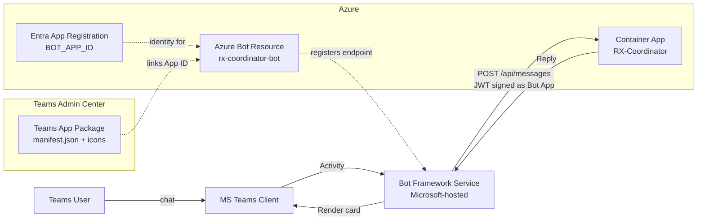
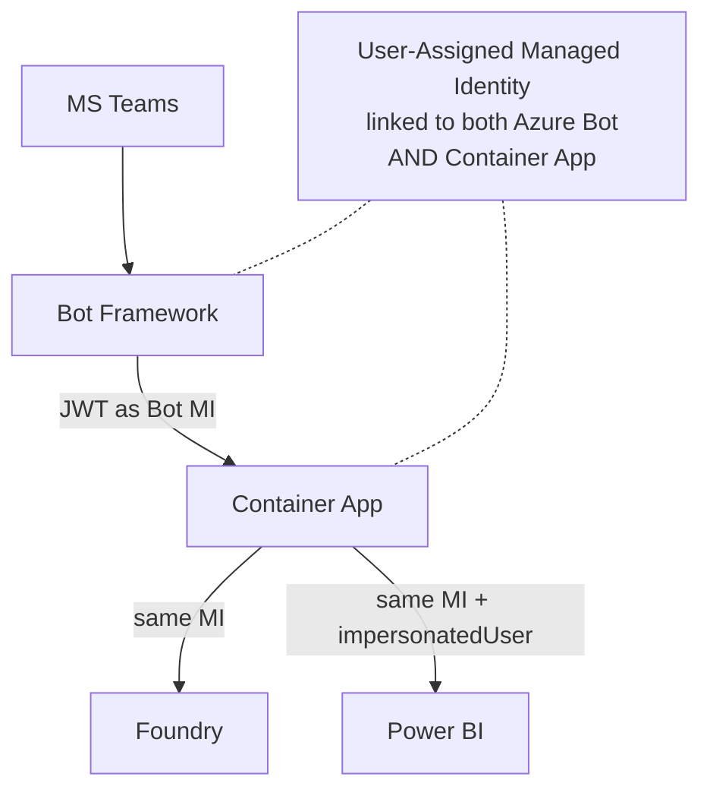

# Azure Bot Service + Microsoft Teams Integration

This guide walks through everything required to publish RX-Commercial-Intelligence as a bot in Microsoft Teams. The M365 Agents SDK handles the runtime protocol, but you still need **three Azure resources** and a **Teams app package**.

## Architecture Recap



## What You Need

| Resource | Purpose | Created via |
|---|---|---|
| **Entra App Registration** | Bot identity (App ID + Secret) | `az ad app create` |
| **Azure Bot Resource** | Registers your endpoint with Bot Framework + enables channels | `az bot create` |
| **Container App** | Hosts your Python code at `/api/messages` | Already deployed |
| **Teams App Package** | Tells Teams how to install & render your bot | `manifest.json` + icons zipped |

> ❌ You **cannot** skip the Teams manifest. Teams needs it to know your bot's name, icon, commands, permissions, and which Bot App ID to call. The M365 Agents SDK does not bypass this — it only simplifies the runtime code.

---

## Prerequisites

- Azure subscription with Contributor + User Access Administrator
- Teams admin (or admin approval for app upload in your tenant)
- Container App already running with `/api/messages` endpoint exposed publicly via HTTPS
- VS Code or Azure Portal access

## Step-by-Step

### Step 1 — Create the Bot App Registration

```powershell
# Multi-tenant for dev; switch to single-tenant for prod tenant lock-down
$bot = az ad app create `
    --display-name "RX-Coordinator-Bot" `
    --sign-in-audience AzureADMultipleOrgs `
    --query "{appId: appId, id: id}" -o json | ConvertFrom-Json

$secret = az ad app credential reset `
    --id $bot.appId `
    --years 1 `
    --query "password" -o tsv

Write-Host "BOT_APP_ID     = $($bot.appId)"
Write-Host "BOT_APP_PASSWORD = $secret"
```

Save both values — they go into your Container App's env vars (or Key Vault).

### Step 2 — Create the Azure Bot Resource

```powershell
$rg = "rg-rx-commercial"
$botName = "rx-coordinator-bot"
$endpoint = "https://<container-app-fqdn>/api/messages"  # replace

az bot create `
    --resource-group $rg `
    --name $botName `
    --app-type MultiTenant `
    --appid $bot.appId `
    --endpoint $endpoint `
    --sku F0
```

> Use `--sku S1` for production. `F0` is free tier, limited to 10K messages/month.

### Step 3 — Enable the Teams Channel

```powershell
az bot msteams create `
    --resource-group $rg `
    --name $botName
```

This is the key step that tells Bot Framework: "traffic from Teams should route to this bot." Without it, users can install your Teams app but messages will never reach your endpoint.

### Step 4 — Configure Your Container App

Add these to the Container App's environment (or Key Vault + secret reference):

```
BOT_APP_ID=<appId from Step 1>
BOT_APP_PASSWORD=<secret from Step 1>
MicrosoftAppType=MultiTenant
MicrosoftAppTenantId=
```

The M365 Agents SDK reads these automatically via `ConfigurationBotFrameworkAuthentication`.

### Step 5 — Create the Teams App Manifest

Teams apps are packaged as a zip containing `manifest.json` + two icons. This is the part that cannot be skipped.

Create `teams-app/manifest.json`:

```json
{
  "$schema": "https://developer.microsoft.com/en-us/json-schemas/teams/v1.17/MicrosoftTeams.schema.json",
  "manifestVersion": "1.17",
  "version": "1.0.0",
  "id": "<GENERATE-A-GUID>",
  "packageName": "com.riyadhair.rx-commercial",
  "developer": {
    "name": "Riyadh Air Cx Insights",
    "websiteUrl": "https://riyadhair.com",
    "privacyUrl": "https://riyadhair.com/privacy",
    "termsOfUseUrl": "https://riyadhair.com/terms"
  },
  "name": {
    "short": "RX Commercial",
    "full": "RX Commercial Intelligence"
  },
  "description": {
    "short": "Ask questions about routes, revenue, and load factors.",
    "full": "AI-powered commercial intelligence agent backed by Routes Insights semantic model. Ask natural-language questions, get DAX-backed answers with commercial interpretation."
  },
  "icons": {
    "color": "color.png",
    "outline": "outline.png"
  },
  "accentColor": "#0078D4",
  "bots": [
    {
      "botId": "<BOT_APP_ID from Step 1>",
      "scopes": ["personal", "team", "groupchat"],
      "supportsFiles": false,
      "isNotificationOnly": false,
      "commandLists": [
        {
          "scopes": ["personal", "team", "groupchat"],
          "commands": [
            {
              "title": "Load Factor",
              "description": "e.g. What's the load factor on RUH-LHR for Q1 2025?"
            },
            {
              "title": "Top Routes",
              "description": "e.g. Top 5 routes by RASK last month"
            },
            {
              "title": "Yield Analysis",
              "description": "e.g. Compare yield in Business vs Economy"
            }
          ]
        }
      ]
    }
  ],
  "permissions": ["identity", "messageTeamMembers"],
  "validDomains": []
}
```

**Replace** `<GENERATE-A-GUID>` with `(New-Guid).Guid` output, and `<BOT_APP_ID>` with your App ID.

### Step 6 — Create Icons

Two PNG files in `teams-app/`:
- `color.png` — 192 × 192 px color logo
- `outline.png` — 32 × 32 px transparent white outline

Use a simple "RX" logo or the Riyadh Air mark.

### Step 7 — Package the Teams App

```powershell
cd teams-app
Compress-Archive -Path manifest.json, color.png, outline.png -DestinationPath rx-commercial.zip -Force
```

### Step 8 — Upload to Teams

Two options based on your tenant's policy:

#### Option A — Sideload (Dev/Testing, personal scope)
1. Open Teams → Apps → **Manage your apps** → **Upload an app**
2. Pick **Upload a custom app** → select `rx-commercial.zip`
3. Add to yourself → message the bot

#### Option B — Teams Admin Center (Production, org-wide)
1. Sign in as Teams admin: <https://admin.teams.microsoft.com>
2. **Teams apps → Manage apps → Upload new app**
3. Upload `rx-commercial.zip`
4. Set app policy to allow users or groups
5. Assign to app setup policy if you want it pinned

#### Option C — App Catalog via App Setup Policy
For auto-install to specific users/groups (e.g., Cx team only):
1. Admin Center → **Teams apps → Setup policies**
2. Create `Cx-Insights-Policy` → pin `RX Commercial`
3. Assign policy to the Cx AD group

---

## Testing Flow

### Local test with Bot Framework Emulator (no Teams needed)

1. Install: <https://github.com/Microsoft/BotFramework-Emulator/releases>
2. Run your bot locally: `python -m src.app` (exposes `http://localhost:3978/api/messages`)
3. In Emulator → Open Bot → URL `http://localhost:3978/api/messages` + App ID + Password
4. Chat!

### Test via Teams with Dev Tunnel (bypasses Container App deploy)

```powershell
winget install Microsoft.devtunnel
devtunnel login
devtunnel host -p 3978 --allow-anonymous
# Copy the public URL, update Azure Bot endpoint in portal
```

Then update the Azure Bot resource's endpoint to the dev-tunnel URL and chat via Teams.

### Test in deployed Container App

1. Ensure `BOT_APP_ID` / `BOT_APP_PASSWORD` env vars are set in Container App
2. Container App must be public (ingress external, HTTPS)
3. Azure Bot endpoint points to `https://<fqdn>/api/messages`
4. Upload `rx-commercial.zip` to Teams → message the bot

---

## Troubleshooting

| Symptom | Cause | Fix |
|---|---|---|
| "Something went wrong" in Teams | Endpoint unreachable or 401 | Check Container App ingress is public + JWT validation |
| 401 in Container App logs | `BOT_APP_ID` mismatch | Env var must match App Registration App ID |
| Bot responds in Emulator but not Teams | Teams channel not enabled | Re-run `az bot msteams create` |
| Can't upload manifest | Teams admin blocks custom apps | Admin must allow custom app upload in app permission policy |
| Bot doesn't appear in Teams search | Sideloaded (only visible to you) | Upload via Teams Admin Center for org-wide |
| "Upload failed: invalid manifest" | GUID missing or wrong schema version | Regenerate `id`, verify `manifestVersion` |
| Commands don't show in Teams UI | `commandLists` scope mismatch | Include all scopes you declared in `bots[].scopes` |

---

## Identity End State (Recommended)



After the initial setup works, replace the App Registration secret with a User-Assigned Managed Identity (see `docs/identity-model.md` if that exists, or ask Copilot to draft it). You end up with **one identity** for:
- Bot authentication to Teams
- Foundry agent invocation
- PBI dataset queries

Zero secrets in env vars — only the Bot App Registration App ID remains (used as an identifier, not a credential).

---

## Files Reference

All Teams integration artifacts live in `teams-app/`:
- `manifest.json` — Teams app definition
- `color.png` — 192×192 logo
- `outline.png` — 32×32 monochrome logo
- `rx-commercial.zip` — packaged upload artifact (git-ignored)

---

## What the M365 Agents SDK *Does* Eliminate

To be concrete about what the SDK buys you vs older Bot Framework v4:

| Without SDK (v4) | With M365 Agents SDK |
|---|---|
| Manual `TeamsActivityHandler` subclass for every event type | Unified `ActivityHandler` with cleaner hooks |
| Per-channel parsing of channel data | SDK normalizes across Teams/WebChat/Emulator |
| Manual OAuth Connection settings for SSO | First-class M365 identity integration |
| Separate code paths for 1:1 vs channel vs group chat | Single code path, scope auto-detected |
| Hand-rolled Adaptive Card action handlers | Built-in `onAdaptiveCardInvoke` |

But **none of these eliminate the manifest** — Teams has always required one to install any custom app. The SDK makes the *code* leaner, not the *deployment*.
